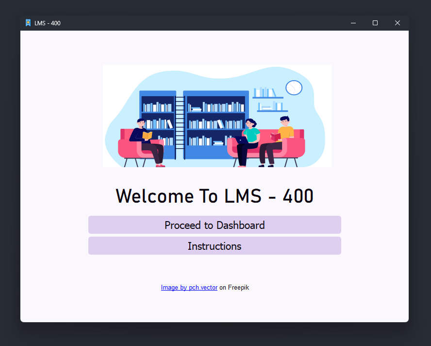
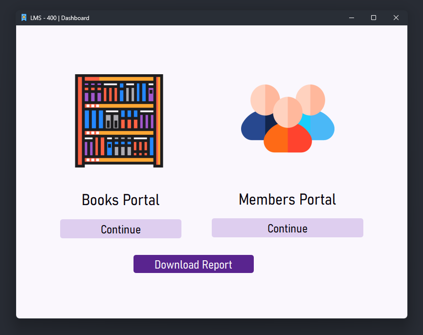
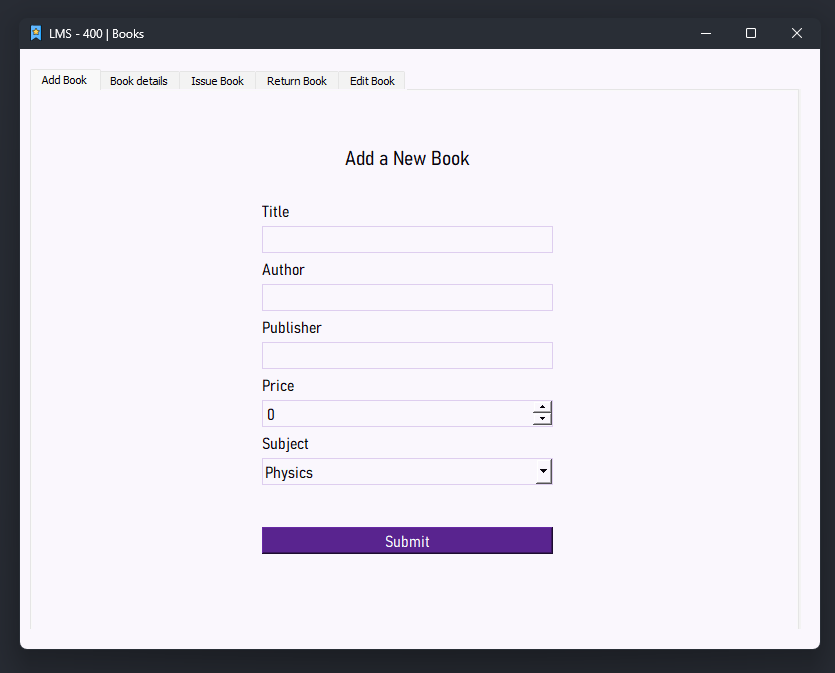
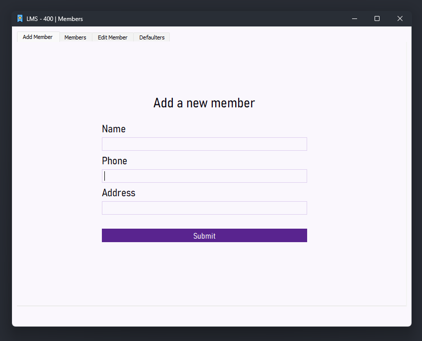
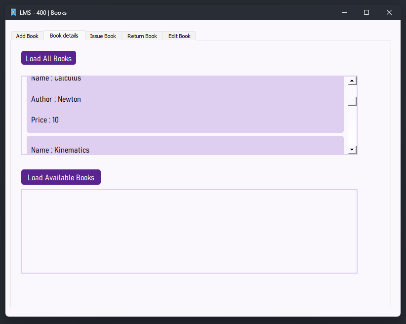

# 📚 LMS - 400

Reminds you of a submarine/sea vessel? Exactly what we thought of too!



## Project Details

This project was created for the CBSE final project, integrating python concepts with mysql. LMS stands for "Library Management System". It is a simple app to manage books through a GUI made using PyQt5 with it's backend in a local mysql database.

## Credits

-   The project colorscheme was generated using [realtime-colors](https://realtimecolors.com/?colors=0a050f-faf7fd-59248f-deceef-7305e1).
-   The app icon (bookmark) was <a href="https://www.flaticon.com/free-icons/bookmark" title="bookmark icons">created by Freepik - Flaticon</a>
-   Hero image by <a href = "https://www.freepik.com/free-vector/people-library-flat-vector-illustration_9176169.htm#query=library%20svg&position=6&from_view=keyword&track=ais">pch.vector on Freepik</a>

## Prerequisites

1. Python 3.x
2. MySQL 8.x
3. [XlsxWriter module](https://pypi.org/project/XlsxWriter/)
4. [Python mysql-connector library](https://pypi.org/project/mysql-connector-python/)
5. [PyQt5](https://pypi.org/project/PyQt5/)

## Install & Setup

Using the MySQL client, make sure that you create a database. The following is the command to create a new database in MySQL command line :

```bash
create database <db-name>;
```

Once you have completed the above step, you may proceed with installing and setting up the application from git.

```bash
git clone https://github.com/amazinglySK/lms-400.git
cd lms-400
pip install -r requirements.txt
python app.py
```

Once you've logged in by giving appropriate details, if you wish to seed the database with template data, run the following command :

```bash
python data.py
```

_Voila!_ You're ready to go!

## Contributors

- Mohammed Hussain Raza - Design and Content
- Jonathan Thomas - Design and Content
- Shashwat Krishna - Code

## Screenshots

<p align = "center">









</p>
